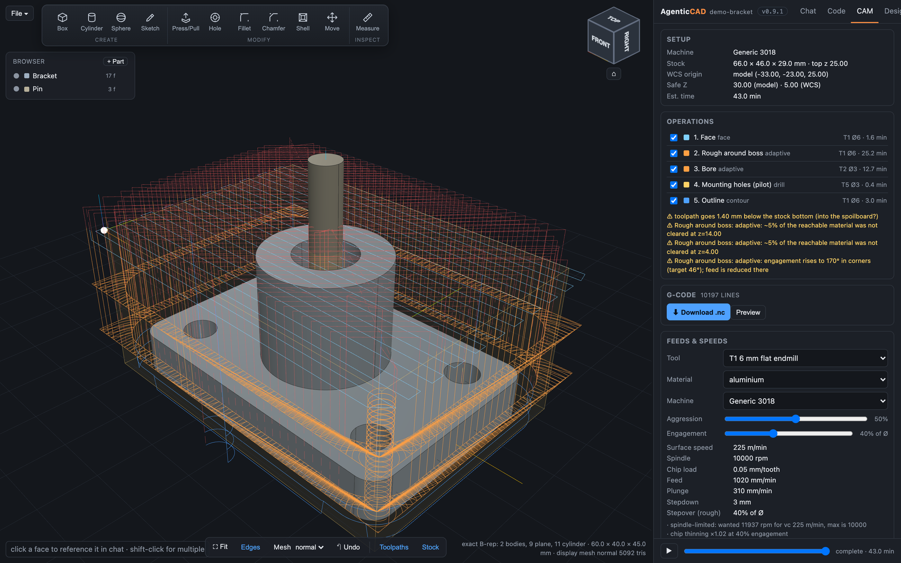

# AgenticCAD — agent-native CAD/CAM



Describe the part; a Claude agent writes [build123d](https://build123d.readthedocs.io) code, the exact
OCCT kernel builds it, and the browser shows it live. Click faces, edges and bodies to reference them in
chat, or use the Fusion-style ribbon to model by hand — every manual operation is written into the same
script, so the design is always one reproducible Python file. Then generate GRBL toolpaths (adaptive
clearing, contours with tabs, drilling, 3D finishing), shop drawings, STEP/STL and G-code.

> Website, docs and simulated tutorials: **https://agenticcad.github.io/agenticcad/**

> Free for non-commercial use under the PolyForm Noncommercial 1.0.0 licence. Commercial use is A$100 per user per year — see [Licence](#licence).

```
browser (three.js viewer · ribbon · sketch editor · chat)  <-- websocket -->  server.py (FastAPI)
                                                                               |-- agent.py       Claude Agent SDK session + in-process MCP tools
                                                                               |-- cad_kernel.py  build123d exec, exact B-rep, display meshing, export
                                                                               |-- cam_kernel.py  2.5D/3D toolpaths, GRBL post
                                                                               |-- drawing.py / threads.py / library.py / script_edit.py
                                                                               `-- workspace/     designs, library, machines, tools, history, exports
```

## Run

**Desktop app** (macOS Apple Silicon `.dmg`, Windows `.msi`): download from the
[website](https://agenticcad.github.io/agenticcad/#download) or the [releases](https://github.com/agenticcad/agenticcad/releases).
The app **requires [Claude Code](https://docs.anthropic.com/en/docs/claude-code/setup) installed separately**
(it is Anthropic's tool and is not bundled); the app shows a setup page with the install and sign-in steps if
it is missing, and a "not signed in" banner with two fixes (run `claude` and log in, or paste an API key in Settings) when the login has expired. Builds are unsigned for now (macOS: right-click → Open; Windows: SmartScreen → More info → Run anyway).
Data lives in the OS user-data folder (`~/Library/Application Support/AgenticCAD`, `%LOCALAPPDATA%\AgenticCAD`).

**From source:**

```bash
cd agenticcad
.venv/bin/python server.py          # http://127.0.0.1:8765
```

Auth: the Agent SDK's bundled Claude Code binary uses your Claude Code login; set `ANTHROPIC_API_KEY`
to use an API key instead. The default model is Claude Opus 5.5 (`claude-opus-5-5`); change it in Settings ⚙ or with `AGENTICCAD_MODEL=<model id>`.

Setup from scratch: `python3 -m venv .venv && .venv/bin/pip install -r requirements.txt`.

**Building the desktop app** ([Briefcase](https://briefcase.beeware.org), config in `pyproject.toml`):

```bash
.venv/bin/pip install briefcase==0.4.5
.venv/bin/briefcase create macOS && .venv/bin/briefcase build macOS && .venv/bin/briefcase package macOS --adhoc-sign
```
The `package` GitHub workflow does this for macOS and Windows on every published release and attaches the
installers. `cleanup_paths` strips the Claude Code binary that the Agent SDK wheel ships, so the app never
redistributes it; `agent.find_claude_cli()` locates the user's own install.

## Agent tools (in-process MCP server `cad`)

| tool | purpose |
|---|---|
| `build_model(code)` | replace the script, rebuild, return summary (bbox, volume, largest faces) or traceback |
| `inspect_model(kind?, near?, limit?)` | list faces: id, type, area, centre, normal, size, radius |
| `screenshot(view, highlight_faces?, show_edges?)` | browser renders a 1024×768 PNG returned as an image block |
| `export_model(name?, formats?)` | STEP / STL into `workspace/exports/` |
| `get_code()` | current script |
| `save_design(name?)` | save the script into `workspace/designs/` (only when the user asks) |
| `slicer_info(machine?)`, `slice_for_printing(...)` | **only when a slicer is installed**: printers/profiles; slice for 3D printing and show the layers |

## UI

- Click a face → chip in the composer; the message gets a `[Selected geometry]` block with the face's
  type/centre/normal/size so the agent can select the same face in code. Shift-click for several.
- **Reference images**: attach photos, sketches or drawings with 📎, drag-and-drop onto the composer or
  viewer, or paste from the clipboard. They are downscaled in the browser (≤1600 px JPEG), sent inline with
  the message (the agent sees them directly), kept as thumbnails in the bubble, and saved to
  `workspace/images/` so the agent can re-read them. Dimensions in your text override what it estimates.
- The sent message keeps its selection chips ("with Bracket · #16 plane +Z 24×24"). The faces stay lit
  (dimmer orange) while the agent works, until the next rebuild or click. Hover a chip later to see a
  marker where that face was; click it to select the same face again (matched by type and centre,
  since ids are renumbered on every rebuild).
- Navigation: Fusion-style **ViewCube** top-right — click a face, edge or corner to look from there
  (animated, keeps zoom), drag it to orbit, `⌂` for the home/fit view. Orbit/pan/zoom with the mouse as usual.
- Bottom toolbar: Fit, Edges, display-mesh quality, Undo (revert to previous build).
- File menu: New / Open / Save / Save as / Import .py / Download .py / **Export STEP** / **Export STL…**
  (dialog: resolution + all-or-one body).
- Side panel: drag the divider to resize (double-click resets), `⟩` or ⌘B hides it, `⟨` tab on the right edge shows it again. Remembered per browser.
- Code tab: the current script with Python syntax highlighting (CodeMirror); edit and Run (⌘↩) to rebuild without the agent.
- Every successful build is saved to `workspace/history/<ms>.py`.

## Designs (files)

A design **is** its build123d script. `File ▸ Save / Save as…` writes `workspace/designs/<name>.py`;
`Open…` lists them; `New` starts an empty design (a fresh workspace starts empty too); `Import .py…` uploads a script from disk;
`Download .py` gives you the current one. The title shows the design name and a `•` when unsaved.
The last-open design is reopened on restart. The agent gets a `[Note]` when you open/import/undo or
edit the script by hand, so it re-reads the code before editing.

## Bodies and the Browser tree

`result` may be a single shape, a dict `{name: shape}`, or nested dicts for components:

```python
result = {"Base": {"Bracket": bracket.part, "Washer": washer}, "Pin": pin}
```

Bodies stay separate solids (STEP keeps them separate). A shape containing disjoint solids is split
into bodies automatically. The **Browser** panel (top-left) shows the tree: click a body to select it
(chip in chat), the dot toggles visibility, double-click zooms to it. Faces are numbered globally and
each face knows its body; `inspect_model(body=...)` filters by body and `export_model(body=...)`
exports one body.

**Rename / delete a body manually**: right-click a row in the Browser (or its `⋯`) → Rename…, Delete,
Hide/Show, Zoom to, Export STEP/STL of that body. Rename and Delete rewrite the script directly
([script_edit.py](script_edit.py), AST-based) when the body is a literal key in
`result = {...}` — instant, no agent turn, and Undo restores it. If the script doesn't name bodies
that way (e.g. `result = part`, or auto-split solids) the request is handed to the agent instead.
Deleting the last body at a level is refused.

## Design tab: parameters, measure, drawings, library

- **Parameters**: every top-level `name = number` in the script is an editable field (↑↓ ±1, ⇧ ±10, ⌥ ±0.1).
  Changing one rewrites that literal in the script and rebuilds; the agent is told. Agent tools:
  `get_parameters`, `set_parameters`.
- **Measure** (📐 or `M`): click up to two faces/points in the viewer → point distance with Δxyz, minimum
  face distance, plane gap, centre distance, angle between normals, hole axis spacing; click bodies in the
  Browser for volume/mass/centre of mass, two bodies for clearance or interference volume. Agent tools:
  `measure`, `mass_properties` (material names or g/cm³).
- **Shop drawings** (Design tab or File ▸ Shop drawings…): third-angle front/top/right + iso with hidden
  lines, overall dimensions, hole callouts (n× Ø, THRU/depth), lettered holes with a coordinate table,
  title block (size, mass, scale, date). SVG per body + assembly, plus DXF of the view geometry
  ([drawing.py](drawing.py)). Agent tool: `make_drawings`.
- **STEP import** (File ▸ Import STEP…, or drop a .step on the viewer): as a new body in the current design
  (`import_step("file.step")` is added to the script), as a new design, or straight into the library.
- **Part library** (its own tab, and in the Browser): parts are parametric scripts (whole design saved with
  its parameters) or exact STEP bodies, with description, tags and thumbnail, in `workspace/library/<part>/`.
  Browser ▸ **+ Part** inserts one (adds `from_library("name", param=value)` as a new body); right-click a
  body ▸ **Save to library…**; Library tab: search, insert, delete, + Design (parametric), + STEP.
  The agent sees the part names in every turn and has `library` (list/search/get/insert/save_design/
  save_body/delete); it is told to check the library before modelling standard or reusable parts.
- **Measure** snaps: vertex > edge > face point, with a live readout (line length, arc radius and sweep,
  circle Ø). Two picks give distance with closest points drawn and labelled in the viewer, Δxyz, and the
  angle (line-line, line-plane, plane-plane) with parallel/perpendicular flags; two circles give centre
  spacing. Backspace/right-click removes the last pick, Esc clears. Agent `measure` accepts edge ids too.

## Install

```bash
python3 -m venv .venv && .venv/bin/pip install -r requirements.txt
.venv/bin/python server.py        # http://127.0.0.1:8765 (PORT env overrides)
```
Auth: the Claude Agent SDK uses your Claude Code login (or `ANTHROPIC_API_KEY`).

## Fidelity model

- The **kernel geometry is exact B-rep** (OCCT): planes, cylinders, cones, spheres, tori, B-splines.
  `inspect_model` reports the analytic face type and radius; the viewer's status line lists them.
- The **viewer mesh is display-only**. It is generated from the exact shape with exact per-vertex surface
  normals (so cylinders shade perfectly round) at a preset chordal/angular deviation — `Mesh: draft /
  normal / fine` in the toolbar re-tessellates without rebuilding. Face picking maps triangles back to
  B-rep faces, so a click always selects the true face.
- **STEP export is exact** (true `CYLINDRICAL_SURFACE` etc.; no triangles).
- **STL is tessellated only at export time**, at the deviation you choose (toolbar dropdown, or the
  agent's `export_model(tolerance, angular_tolerance)`); it never reuses the display mesh.

## CAM (GRBL) — experimental

> **Experimental.** Toolpaths are geometrically correct and machine-checked, but not optimised (long, conservative
> paths, many retracts, no stock simulation). Inspect every program before running it. Modelling, export and
> drawings are the stable part today.

Agent-native, like the CAD side: a second script per design, `cam.py`, written by the agent against
[cam_kernel.py](cam_kernel.py) and built with the `build_cam` tool. Saved with the design as `<name>.cam.py`.

- **Libraries**: `workspace/machines/*.json` (travel, max feeds, rapid, spindle range, safe/clearance Z,
  tool-change policy `pause|none|split`, start/end G-code blocks) and `workspace/tools.json` (flat / ball /
  V-bit / drill with feeds, plunge, stepdown, stepover). Edit in the CAM tab (JSON) or ask the agent
  (`save_machine`, `save_tool`).
- **Geometry from the exact B-rep**: `section(part, z)`, `silhouette`, `stock_minus(setup, part, z)`,
  `holes(part)` (vertical round holes from concave cylindrical faces, with through detection),
  `face_polygon(model.get_face(id))` for a clicked face.
- **Operations**: `face`, `contour` (outside/inside/on, depth passes, tabs, climb), `pocket` (concentric,
  islands), `drill` (peck), `parallel3d` (heightmap raster finishing, ball or flat). All in model coords.
- **Post**: `Program.gcode()` → GRBL dialect (G21 G90 G94 G17, G54, M3 S, G0/G1, F on change, M6/M0 tool
  change pauses, M30). WCS origin choices: stock-top-left / stock-top-center / stock-bottom-left /
  stock-bottom-center / model-origin / (x, y, z). Checks: machine travel, spindle range, feeds clamped,
  cutting below stock bottom, multi-tool with `tool_change=none`.
- **UI**: CAM tab (setup, operations with colour/visibility, warnings, G-code download/preview, machine
  and tool libraries), toolpaths + stock + WCS origin drawn in the viewer (rapids red dashed),
  simulation slider with a tool marker, Code tab switch to `cam.py`.
- **Arcs**: the post fits G2/G3 to circular runs (chord-sagitta checked, ≤180° per arc; `machine.arcs`,
  `machine.arc_tolerance`) and merges collinear moves. **Lead-in/out**: tangential quarter arcs on contours
  (`lead=`), start mid-way along the longest straight edge. **Adaptive**: see above. **Rest machining**:
  `rest_from=` on `pocket` / `adaptive` (2.5D, morphological opening) and `parallel3d` (3D tip-map difference).
  **Feeds & speeds**: `feeds(tool, material, machine)` / `apply_feeds(...)`, 13 materials, spindle and feed
  clamping, radial chip thinning; CAM-tab calculator with "Apply to tool"; agent tool `feeds_speeds`.
- Not yet: 4-axis, drilling cycles (GRBL has none), thread milling.

## 3D printing (external slicer)

AgenticCAD does not bundle a slicer. If **OrcaSlicer** (or Bambu Studio, same CLI) is installed on the computer
the Design tab grows a **3D printing** section and the agent gets two extra tools; otherwise neither exists.

- **Detection**: `/Applications/OrcaSlicer.app` (macOS), `Program Files\OrcaSlicer` (Windows), `orca-slicer` on PATH
  (Linux); override with `AGENTICCAD_SLICER=/path/to/exe[::/path/to/profiles]`. Printer, quality and filament
  lists come from the slicer's own profiles (system vendors + your user presets); the printer selected in the
  slicer is preselected.
- **Options**: printer, quality (process) profile, filament, one body or the whole design, layer height, infill %,
  wall loops, supports, brim. Anything else stays as the chosen profile says. The agent uses the same options:
  *"slice this for my Ender 3 at 0.28 mm with supports"*.
- **How**: the design is exported as STL (0.02 mm), the profiles' `inherits` chains are flattened (the CLI needs
  flat JSON), your overrides applied, and the slicer is run headless (`--slice 0 --arrange 1 --export-3mf`).
  Outputs land in `workspace/slicing/` (G-code + 3MF, downloadable from the section).
- **Preview**: the G-code is parsed into extrusion segments per layer, mapped back from bed to model coordinates
  using the 3MF placement, coloured by feature (walls, infill, top/bottom, support, skirt...) and drawn in the
  viewer with a layer slider and a per-feature legend; the model hides while previewing (toggle). Stats: layers,
  height, estimated time, filament weight/length, and slicer warnings.
- Not a slicer UI: for per-object settings, modifiers, painting or multi-plate work, open the 3MF in the slicer.

## Settings (⚙ in the panel header)

Model (default Claude Opus 5.5; any Claude model id, or the Claude Code default), effort (low…max), max steps per turn, thinking
summary on/off, web tools on/off, extra standing instructions, and **MCP servers** (stdio / http / sse
configs as JSON, enable toggles, live connection status from the session). Saved to
`workspace/settings.json`; "Save & restart agent" starts a fresh session with the new options (the agent
is told its earlier chat history is gone). API: `GET/POST /api/settings`, `GET /api/agent/status`,
`POST /api/agent/restart`.

## Sketches

Fusion-style 2D sketches on a face or base plane, drawn in the viewer: select a planar face (or none for
XY/XZ/YZ + offset) → **✎ Sketch**. The camera snaps square to the plane; draw rectangles, circles,
polygons and slots by clicking (grid snap, alt = free), toggle subtract, edit numbers in the item list,
Finish. The sketch is stored in the script as a block

```python
# sketch:sketch1 {"plane": {...}, "items": [...]}
with BuildSketch(Plane(origin=..., x_dir=..., z_dir=...)) as _sketch1:
    with Locations((5, 0)):
        Rectangle(20, 10)
    ...
sketch1 = _sketch1.sketch
# /sketch:sketch1
```

so it is a normal build123d `Sketch` variable the agent can `extrude` / cut / `revolve`, and the JSON
header lets the editor reopen it (Browser ▸ Sketches ▸ double-click or ⋯). Sketches render as cyan
outlines and can be selected as chat chips. The **agent edits sketches through the `sketch` tool**
(list/get/set/delete, same item format), so anything it draws stays editable by you and vice versa.

### Modelling ribbon (Fusion-style, no agent turn)
Top of the viewer: **Create** Box `B` / Cylinder `C` / Sphere `O` / Sketch `K`, **Modify** Press/Pull `Q` /
Hole `H` / Fillet `F` / Chamfer `X` / Shell `L` / Move `V`, **Inspect** Measure `I`. Hover for a tooltip
with the shortcut and what to click. A tool opens a command dialog under the ViewCube that walks you
through it: step indicator, a live prompt ("Click a face…"), chips for what you picked (× to drop),
fields with units (↑↓ ±1, ⇧ ±10, ⌥ ±0.1), ↵ OK, ⌫ removes the last pick, Esc cancels. Every operation is written as code on the body's
expression in `result` — e.g. `_bracket = bp.part` hoisted before `result`, then
`"Bracket": _bracket + extrude(_bracket.faces().sort_by_distance((9, 0, 24))[0], amount=5, dir=(0, 0, 1))`
— so the design stays a script, Undo works, and the agent sees a `[Note]` of what you did.
Primitives are placed with their base on the clicked face along its normal; holes can be plain,
counterbored, or tapped (M2…M12); fillet/chamfer take edges or whole faces; shell opens the picked faces.

### Other manual modelling
- Browser ▸ **+ Body**: box / cylinder / sphere with dimensions and centre.
- Sketches ▸ ⋯ ▸ **Extrude…**: distance, direction, and new body / join to body / cut from body.
- Body ▸ ⋯ ▸ **Move / rotate…**: wraps the body expression in `Pos(...) * Rot(...) * (...)`.
All of these rewrite the script (`script_edit.add_body` / `wrap_body_expr`), so the design stays one
script and the agent is told what you did.

## Threads ([threads.py](threads.py))

ISO metric tables (pitch, tap drill, clearance fine/medium/coarse, hex/socket/nut/washer sizes) and
script helpers: `iso("M4")`, `tap_drill`, `clearance_dia`, `tapped_hole(size, depth, at=..)` (cosmetic
cutter), `tap(part, size, at=.., depth=.. | through=True, real=False)` (cuts, and with `real=True` models
the helix via bd_warehouse), `bolt(size, length, head=hex|socket|none, real=False)`, `nut`, `washer`.
Tapped holes are registered per build: the model summary lists them and shop drawings call them out
("M4×0.7 THRU" instead of "Ø3.3").

## Versioning

`version.py` holds the version (shown as a badge in the header; click it for the changelog). Every
feature or fix gets a line in `CHANGELOG.md` under the next version, and a release is a bump in
`version.py` plus a git tag:

```bash
# after editing version.py and CHANGELOG.md
git commit -am "Release 0.10.0" && git tag v0.10.0
```

Pre-1.0: minor bump for features, patch bump for fixes. `/api/version` serves both to the UI.

## Tests and evals

```bash
.venv/bin/python -m pytest -q            # 123 unit/API tests, ~20 s, no Claude calls
.venv/bin/python evals/run.py            # agent evals, 26 cases, ~$3.50, ~2 min (3-4 in parallel); needs a Claude login or API key
.venv/bin/python evals/run.py --filter cam --model claude-sonnet-5 --repeat 3
```

- **Unit tests** (`tests/`): kernel (bodies, ids, exact normals, exports, measurement), script editing
  (params, rename/delete/add), CAM (holes, sections, every op, arc post, machine checks, feeds, and an
  independent fine-grid engagement audit of the adaptive op), drawings, library, and the FastAPI/WebSocket
  API with the Claude session disabled (`AGENTICCAD_NO_AGENT=1`, `AGENTICCAD_WORKSPACE=<tmp>`).
- **Evals** (`evals/`): the real agent runs headless in a throwaway workspace (the screenshot tool is an
  offscreen matplotlib render), one fresh session per case, graded by deterministic geometry / program /
  answer checks (`harness.py` helpers: bbox, bodies, holes, volume, params, script contents, op params,
  G-code validity, tools used, answer regex). Each run writes `evals/results/<stamp>.json|.md` with pass
  rate, cost, steps and time per case. Exit code 1 on any failure (`--allow-fail` to override).
  Add a case by appending a `Case(...)` to `evals/cases.py`.

## Status, gaps and roadmap

**Status (v0.9.x):** working end to end on a single machine for a single user — design by chat, by
hand, or both; multi-body designs; sketches; threads; measurement; drawings; part library; CAM with a
GRBL post; settings for model/effort/MCP servers; unit tests and graded agent evals. Treat it as a
capable prototype, not a shipped product: the modelling kernel is exact and the toolpaths are checked,
but nothing here has been run on a real machine yet by anyone but the author.

### Known gaps
- **One project, one session.** A single global design and one agent session per server; two browsers
  or two people will interfere. Chat history is not persisted across server restarts.
- **No stock simulation or collision checking in CAM.** Toolpaths are drawn, but there is no cut
  simulation showing the finished part, gouges, or a holder hitting a wall; flute-length vs depth is left
  to the agent's judgement. Time estimates ignore acceleration.
- **Adaptive corners rely on feed reduction**, not on geometry; ring-shaped regions still retract for
  some links. No trochoidal slotting op, no rest for 3D, no Z-level (waterline) finishing.
- **Sketches are basic**: rectangles, circles, polygons, slots; no lines/arcs with constraints,
  no dimensions on the sketch, no snapping to model edges.
- **Manual tools are typed, not dragged** (except Press/Pull): no drag handles for primitives,
  no mates/joints for positioning library parts; no patterns, mirror, loft or sweep by hand.
- **Drawings** have overall dimensions and hole tables only; no section views, no feature
  dimensions, no PDF.
- **Library parts land at the origin** and are moved afterwards; there is no standard-parts seed
  (fasteners, bearings, inserts) yet.
- **Face and edge ids change on every rebuild**; references in the script use clicked points, which
  survive edits but can pick a neighbour if geometry moves under them.
- Display: cylinder/sphere seam edges are drawn; screenshots for the agent are JPEG (size-capped).

### Roadmap (rough order)
1. **Projects and sessions** — a project per folder, one agent session per project, persisted chat via
   SDK session resume. Prerequisite for deploying as a shared service.
2. **CAM stock simulation + collision checks** — voxel/heightmap cut sim, holder/shank checks, realistic
   time estimates. Then Z-level finishing, trochoidal slotting, thread milling, ramp entries.
3. **Assembly positioning** — mate-style placement (face-to-face, concentric) for library parts, and a
   seeded standard-parts library (ISO fasteners, nuts, washers, bearings, heat-set inserts).
4. **Sketch upgrades** — lines and arcs, snapping to model edges, driven dimensions, constraints.
5. **Drag handles everywhere** — primitives, holes, fillet radius, sketch items.
6. **G-code sender** — WebSerial to GRBL: jog, DRO, probing, streaming with a progress marker.
7. **Drawings** — section views, feature dimensions, PDF; **imports** — DXF/SVG profiles.
8. **Deployment** — Docker image, auth, multi-user, GitHub Pages site.
9. **Other posts** (LinuxCNC, Marlin) and 3D-printing exports (3MF, orientation analysis).

Contributions and issues welcome at https://github.com/agenticcad/agenticcad.

## Licence

AgenticCAD is **free for non-commercial use** under the
[PolyForm Noncommercial License 1.0.0](LICENSE): personal projects, research, education, hobby making,
and use by charities, schools and public institutions. See the LICENSE file for the exact terms.

**Commercial use** (using it in a business, in products or services, or as part of paid work) needs a
commercial licence: **A$100 per user per year**, one licence per person who uses it, same software.
Buy online for the number of users you need; the receipt is your licence record and there is nothing to
enter in the app. Volume or site licences: **agenticcad@prodevelop.com.au**. Details: https://agenticcad.github.io/agenticcad/#licence