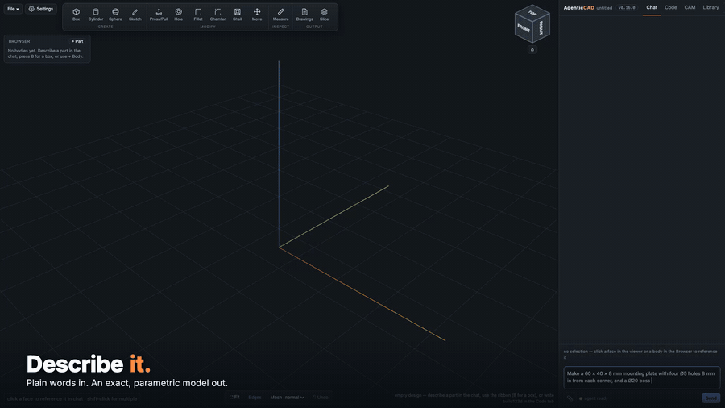
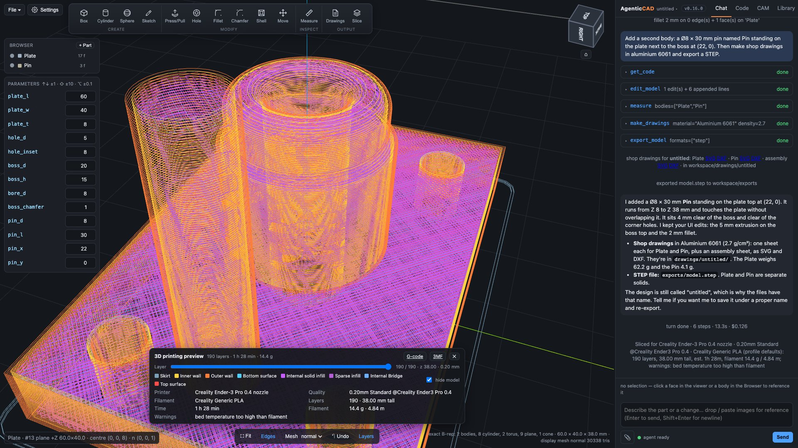

# AgenticCAD — agent-native CAD/CAM



Describe the part; a Claude agent writes [build123d](https://build123d.readthedocs.io) code, the exact
OCCT kernel builds it, and the browser shows it live. Click faces, edges and bodies to reference them in
chat, or use the Fusion-style ribbon to model by hand — every manual operation is written into the same
script, so the design is always one reproducible Python file. Then generate GRBL toolpaths (adaptive
clearing, contours with tabs, drilling, 3D finishing), shop drawings, STEP/STL and G-code.

> Website, docs and simulated tutorials: **https://agenticcad.github.io/agenticcad/**

> Free for non-commercial use under the PolyForm Noncommercial 1.0.0 licence. Commercial use is A$99 per user per year — see [Licence](#licence).

```
browser (three.js viewer · ribbon · sketch editor · chat)  <-- websocket -->  server.py (FastAPI)
                                                                               |-- agent.py       Claude Agent SDK session + in-process MCP tools
                                                                               |-- cad_kernel.py  build123d exec, exact B-rep, display meshing, export
                                                                               |-- cam_kernel.py  2.5D/3D toolpaths, GRBL post
                                                                               |-- drawing.py / threads.py / library.py / script_edit.py
                                                                               `-- workspace/     designs, library, machines, tools, history, exports
```

## Run

**Desktop app** (macOS Apple Silicon `.pkg`, Windows `.msi`; both show the licence and terms to accept during install): download from the
[website](https://agenticcad.github.io/agenticcad/#download) or the [releases](https://github.com/agenticcad/agenticcad/releases).
The app **requires [Claude Code](https://docs.anthropic.com/en/docs/claude-code/setup) installed separately**
(it is Anthropic's tool and is not bundled); the app shows a setup page with the install and sign-in steps if
it is missing, and a "not signed in" banner with two fixes (run `claude` and log in, or paste an API key in Settings) when the login has expired. Builds are unsigned for now (macOS: if the installer is blocked, right-click → Open or System Settings → Privacy & Security → Open Anyway; Windows: SmartScreen → More info → Run anyway).
Data lives in the OS user-data folder (`~/Library/Application Support/AgenticCAD`, `%LOCALAPPDATA%\AgenticCAD`).

**From source:**

```bash
cd agenticcad
.venv/bin/python server.py          # http://127.0.0.1:8765
```

Auth: the Agent SDK's bundled Claude Code binary uses your Claude Code login; set `ANTHROPIC_API_KEY`
to use an API key instead. The default model is Claude Opus 5.5 (`claude-opus-5-5`); change it in Settings ⚙ or with `AGENTICCAD_MODEL=<model id>`.

Setup from scratch: `python3 -m venv .venv && .venv/bin/pip install -r requirements.txt`.

**Building the desktop app** ([Briefcase](https://briefcase.beeware.org), config in `pyproject.toml`):

```bash
.venv/bin/pip install briefcase==0.4.5
.venv/bin/briefcase create macOS && .venv/bin/briefcase build macOS && .venv/bin/briefcase package macOS --adhoc-sign
```
The `package` GitHub workflow does this for macOS and Windows on every published release and attaches the
installers. `cleanup_paths` strips the Claude Code binary that the Agent SDK wheel ships, so the app never
redistributes it; `agent.find_claude_cli()` locates the user's own install.

## Agent tools (in-process MCP server `cad`)

| tool | purpose |
|---|---|
| `build_model(code)` | replace the script, rebuild, return summary (bbox, volume, largest faces) or traceback |
| `edit_model(edits?, append?)` | change the existing script in place (exact-text replacements + code appended before `result`), rebuild; nothing applied if the build fails |
| `inspect_model(kind?, near?, limit?)` | list faces: id, type, area, centre, normal, size, radius |
| `screenshot(view, highlight_faces?, show_edges?)` | browser renders a 1024×768 PNG returned as an image block |
| `export_model(name?, formats?)` | STEP / STL into `workspace/exports/` |
| `get_code()` | current script |
| `save_design(name?)` | save the script into `workspace/designs/` (only when the user asks) |
| `kit(action, ...)` | the Design Kit: `toc`, `search`, `read` components and guides; `note`, `save_guide`, `save_part` into the workspace's kit |
| `slicer_info(machine?)`, `slice_for_printing(...)` | **only when a slicer is installed**: printers/profiles; slice for 3D printing and show the layers |

## UI



- Click a face → chip in the composer; the message gets a `[Selected geometry]` block with the face's
  type/centre/normal/size so the agent can select the same face in code. Shift-click for several.
- **Reference images**: attach photos, sketches or drawings with 📎, drag-and-drop onto the composer or
  viewer, or paste from the clipboard. They are downscaled in the browser (≤1600 px JPEG), sent inline with
  the message (the agent sees them directly), kept as thumbnails in the bubble, and saved to
  `workspace/images/` so the agent can re-read them. Dimensions in your text override what it estimates.
- The sent message keeps its selection chips ("with Bracket · #16 plane +Z 24×24"). The faces stay lit
  (dimmer orange) while the agent works, until the next rebuild or click. Hover a chip later to see a
  marker where that face was; click it to select the same face again (matched by type and centre,
  since ids are renumbered on every rebuild).
- Navigation: Fusion-style **ViewCube** top-right — click a face, edge or corner to look from there
  (animated, keeps zoom), drag it to orbit, `⌂` for the home/fit view. Left-drag orbits, right-drag (or ⌘/Ctrl/⇧ + left-drag on a trackpad) pans, wheel zooms.
- Bottom toolbar: Fit, Edges, display-mesh quality, Undo (revert to previous build).
- File menu: New / Open / Save / Save as / Import .py / Download .py / **Export STEP** / **Export STL…**
  (dialog: resolution + all-or-one body).
- Side panel: drag the divider to resize (double-click resets), `⟩` or ⌘B hides it, `⟨` tab on the right edge shows it again. Remembered per browser.
- Code tab: the current script with Python syntax highlighting (CodeMirror); edit and Run (⌘↩) to rebuild without the agent.
- Every successful build is saved to `workspace/history/<ms>.py`.

## Designs (files)

A design **is** its build123d script. `File ▸ Save / Save as…` writes `workspace/designs/<name>.py`;
`Open…` lists them; `New` starts an empty design (a fresh workspace starts empty too); `Import .py…` uploads a script from disk;
`Download .py` gives you the current one. The title shows the design name and a `•` when unsaved.
The last-open design is reopened on restart. The agent gets a `[Note]` when you open/import/undo or
edit the script by hand, so it re-reads the code before editing.

## Bodies and the Browser tree

`result` may be a single shape, a dict `{name: shape}`, or nested dicts for components:

```python
result = {"Base": {"Bracket": bracket.part, "Washer": washer}, "Pin": pin}
```

Bodies stay separate solids (STEP keeps them separate). A shape containing disjoint solids is split
into bodies automatically. The **Browser** panel (top-left) shows the tree: click a body to select it
(chip in chat), the dot toggles visibility, double-click zooms to it. Faces are numbered globally and
each face knows its body; `inspect_model(body=...)` filters by body and `export_model(body=...)`
exports one body.

**Rename / delete a body manually**: right-click a row in the Browser (or its `⋯`) → Rename…, Delete,
Hide/Show, Zoom to, Export STEP/STL of that body. Rename and Delete rewrite the script directly
([script_edit.py](script_edit.py), AST-based) when the body is a literal key in
`result = {...}` — instant, no agent turn, and Undo restores it. If the script doesn't name bodies
that way (e.g. `result = part`, or auto-split solids) the request is handed to the agent instead.
Deleting the last body at a level is refused.

## Parameters, measure, drawings, library

- **Parameters**: every top-level `name = number` in the script is an editable field in the Parameters card under the Browser (↑↓ ±1, ⇧ ±10, ⌥ ±0.1).
  Changing one rewrites that literal in the script and rebuilds; the agent is told. Agent tools:
  `get_parameters`, `set_parameters`.
- **Measure** (📐 or `M`): click up to two faces/points in the viewer → point distance with Δxyz, minimum
  face distance, plane gap, centre distance, angle between normals, hole axis spacing; click bodies in the
  Browser for volume/mass/centre of mass, two bodies for clearance or interference volume. Agent tools:
  `measure`, `mass_properties` (material names or g/cm³).
- **Shop drawings** (ribbon ▸ Drawings, `D`, or File ▸ Shop drawings…; material and sheet in ⚙ Settings): third-angle front/top/right + iso with hidden
  lines, overall dimensions, hole callouts (n× Ø, THRU/depth), lettered holes with a coordinate table,
  title block (size, mass, scale, date). SVG per body + assembly, plus DXF of the view geometry
  ([drawing.py](drawing.py)). Agent tool: `make_drawings`.
- **STEP import** (File ▸ Import STEP…, or drop a .step on the viewer): as a new body in the current design
  (`import_step("file.step")` is added to the script), as a new design, or straight into the library.
- **Part library** (its own tab, and in the Browser): parts are parametric scripts (whole design saved with
  its parameters) or exact STEP bodies, with description, tags and thumbnail, in `workspace/library/<part>/`.
  Browser ▸ **+ Part** inserts one (adds `from_library("name", param=value)` as a new body); right-click a
  body ▸ **Save to library…**; Library tab: search, insert, delete, + Design (parametric), + STEP.
  The agent sees the part names in every turn and has `library` (list/search/get/insert/save_design/
  save_body/delete); it is told to check the library before modelling standard or reusable parts.
- **Measure** snaps: vertex > edge > face point, with a live readout (line length, arc radius and sweep,
  circle Ø). Two picks give distance with closest points drawn and labelled in the viewer, Δxyz, and the
  angle (line-line, line-plane, plane-plane) with parallel/perpendicular flags; two circles give centre
  spacing. Backspace/right-click removes the last pick, Esc clears. Agent `measure` accepts edge ids too.

## Install

```bash
python3 -m venv .venv && .venv/bin/pip install -r requirements.txt
.venv/bin/python server.py        # http://127.0.0.1:8765 (PORT env overrides)
```
Auth: the Claude Agent SDK uses your Claude Code login (or `ANTHROPIC_API_KEY`).

## Fidelity model

- The **kernel geometry is exact B-rep** (OCCT): planes, cylinders, cones, spheres, tori, B-splines.
  `inspect_model` reports the analytic face type and radius; the viewer's status line lists them.
- The **viewer mesh is display-only**. It is generated from the exact shape with exact per-vertex surface
  normals (so cylinders shade perfectly round) at a preset chordal/angular deviation — `Mesh: draft /
  normal / fine` in the toolbar re-tessellates without rebuilding. Face picking maps triangles back to
  B-rep faces, so a click always selects the true face.
- **STEP export is exact** (true `CYLINDRICAL_SURFACE` etc.; no triangles).
- **STL is tessellated only at export time**, at the deviation you choose (toolbar dropdown, or the
  agent's `export_model(tolerance, angular_tolerance)`); it never reuses the display mesh.

## CAM (GRBL, Makera Carvera, Haas, LinuxCNC) — experimental

> **Experimental.** Toolpaths are geometrically correct, machine-checked and can be simulated, but not optimised
> (long, conservative paths, many retracts). Inspect and simulate every program before running it. Modelling,
> export and drawings are the stable part today.

Agent-native, like the CAD side: a second script per design, `cam.py`, written by the agent against
[cam_kernel.py](cam_kernel.py) and built with the `build_cam` tool. Saved with the design as `<name>.cam.py`.

- **Libraries**: `workspace/machines/*.json` (travel, max feeds, rapid, spindle range, safe/clearance Z,
  tool-change policy `pause|manual|none|split`, collet, 4th axis, `max_stepdown` per material for the feeds
  calculator, start/end G-code blocks) and `workspace/tools.json`
  (flat / ball / V-bit / drill with feeds, plunge, stepdown, stepover). Edit them in **Settings ▸ Machines** (a form
  per machine, or JSON) and **Settings ▸ Tools** (an editable table with the feeds & speeds calculator), or ask the
  agent (`save_machine`, `save_tool`).
- **Per-operation tool settings**: click an operation in the CAM tab to see its tool's spindle speed, feed, plunge,
  stepdown and stepover. Blank fields use the tool's values; anything you type overrides them for that operation
  only (with a calculator to fill them for a material). Overrides are one line at the top of `cam.py`,
  `overrides({"Pocket": {"feed": 500, "stepover": 0.3}})`, keyed by operation name (`"Face#2"` for the second op
  with the same name), so they are saved with the design and the agent keeps them.
- **Geometry from the exact B-rep**: `section(part, z)`, `silhouette`, `stock_minus(setup, part, z)`,
  `holes(part)` (vertical round holes from concave cylindrical faces, with through detection),
  `face_polygon(model.get_face(id))` for a clicked face.
- **Operations**: `face`, `contour` (outside/inside/on, depth passes, tabs, climb), `pocket` (concentric,
  islands), `drill` (peck), `parallel3d` (heightmap raster finishing, ball or flat). All in model coords.
- **Post**: `Program.gcode()` → GRBL dialect (G21 G90 G94 G17, G54, M3 S, G0/G1, F on change, M6/M0 tool
  change pauses, M30). WCS origin choices: stock-top-left / stock-top-center / stock-bottom-left /
  stock-bottom-center / model-origin / (x, y, z). Checks: machine travel, spindle range, feeds clamped,
  cutting below stock bottom, multi-tool with `tool_change=none`.
- **UI**: CAM tab (setup, operations with colour/visibility and per-op tool settings, warnings, simulation, G-code
  download/preview), toolpaths + stock + WCS origin drawn in the viewer (rapids red dashed),
  simulation slider with a tool marker, Code tab switch to `cam.py`.
- **Arcs**: the post fits G2/G3 to circular runs (chord-sagitta checked, ≤180° per arc; `machine.arcs`,
  `machine.arc_tolerance`) and merges collinear moves. **Lead-in/out**: tangential quarter arcs on contours
  (`lead=`), start mid-way along the longest straight edge. **Adaptive**: see above. **Rest machining**:
  `rest_from=` on `pocket` / `adaptive` (2.5D, morphological opening) and `parallel3d` (3D tip-map difference).
  **Feeds & speeds**: `feeds(tool, material, machine)` / `apply_feeds(...)`, 13 materials, spindle and feed
  clamping, radial chip thinning; calculator in Settings ▸ Tools ("Apply to tool") and per operation in the CAM tab; agent tool `feeds_speeds`.
- **Setups**: a program can have several `Setup`s (`orient="top" | "bottom" | "front" | "back" | "left" |
  "right"`), each with its own WCS (G54, G55, …). Moves are in the setup frame; `setup.view(part)` gives the part
  as the machine sees it for `section`/`holes`. Between setups the post stops the spindle, parks and pauses for the
  operator to flip or re-fixture (Makera M600, GRBL M0), then restarts the spindle.
- **4th axis** (rotation about X, A in degrees): `Setup(..., rotary=True)` on a machine with `machine.rotary`.
  Indexed 3+1 (`Setup(..., rotary=True, a=90)`; setups on the same mounting share one WCS and just turn A) and
  continuous 4-axis: `rotary_rough` (rings or lines, from a radial height map), `rotary_finish` (lines, rings or a
  continuous spiral, ball or flat), `rotary_wrap` (pocket/contour a 2D pattern wrapped onto a cylinder).
  `Stock.cylinder(d, length)` for bar stock; checks for swing diameter, length and a missing/uninstalled axis.
- **Makera Carvera** (Z1 and Carvera Air, with and without the 4th axis, as built-in machines): a `makera` post
  written against the controller firmware: lines ≤ 63 characters, no N numbers, `M6 Tn` on one line (the machine
  measures the tool after each manual change), M3 only after a tool is active, G28 park, M600 between setups,
  9 work offsets, no arcs while A moves, and A-axis feeds computed the way the firmware interprets F on mixed
  linear + rotary moves. Collet size is checked (1/8" standard).
- **Simulation**: `simulate_cam` (agent) or **Simulate** in the CAM bar runs a material-removal simulation of all
  visible ops or one: a two-sided height map for top/bottom setups, a radial map for 4th-axis setups. The viewer
  shows the stock being cut in step with the slider, with gouges in red and material left in amber on the last
  frame; the summary reports removed volume, gouges (depth, area, which op), material left on the part, stock
  left outside it, and rapids through material. Side setups (front/back/left/right) are not simulated yet.
- **Machine models and collision checks** ([machine_models.py](machine_models.py)): every built-in machine has a
  kinematic 3D model built in build123d from published and measured numbers — Makera Z1 and Carvera Air (bed with the
  real hole grid, moving bed in Y under the rear bridge, head in X/Z, 4th-axis chuck and tailstock, enclosure), Haas
  VF-2 / VF-2SS / VF-4 / Mini Mill / TM-1 (table with the real T-slots, saddle, column, CAT40 + ER32 holder, nose-to-
  table range) and a parametric gantry router for everything else. **Machine** in the ribbon (Output, `A`) shows the
  program's machine around the stock and plays the simulation on it: head, table and chuck move as they would, the
  tool hangs from the spindle, and any part the simulator saw collide flashes red at that move. The simulation itself
  checks the whole stack above the flutes (shank, collet nut, nose, collar, head) against the remaining stock, the
  tool tip against the bed under the spoilboard, and the holder against the chuck and tailstock on 4th-axis jobs;
  contacts are listed in the summary with the op, move, position and depth. Every number carries its source and
  accuracy tier (`verified` / `reference` / `estimated`) in **Settings ▸ Machines ▸ Model**, where measured values
  (nose profile, stickout, spoilboard, clearance) can be entered per machine.
- **Model your own machine** ([machine_script.py](machine_script.py)): a machine's model is a script,
  `workspace/machines/<slug>.machine.py`, in the design-script namespace plus `node(name, parent, axis, mode, stock,
  pivot)`, `part(name, node, shape, material, collision)` and `machine(home, travel, clearance, nose, table, rotary,
  spoilboard, sources, notes)`, with helpers (`box`, `cyl_z/x/y`, `shell`, `bed_holes`, `import_step` for vendor CAD).
  The built-ins live in [machine_scripts/](machine_scripts/) and are the fallback for any machine without its own
  script, so **Code tab ▸ machine.py** always has a starting point: edit, Run, and the machine has its own model.
  The **CAM tab ▸ Machine view** section picks any library machine, shows or hides it (no program needed) and opens or
  closes its doors; door nodes (`node(..., door="hinge"|"slide", ...)`) animate in the viewer. **Settings ▸ Machines ▸
  Model** has *Show in viewer* and *Edit as script…*; the agent's
  `get_machine_code` / `build_machine` do the same from chat ("add my Shapeoko 5 Pro to the library and model it"), and
  photos dropped into the chat are used as references: the built-in Z1, Carvera Air and Haas VF-4 models were made that
  way from the makers' product photos, every number tagged verified / reference / estimated.
- Not yet: drilling cycles (GRBL has none), thread milling, side-setup simulation.

## 3D printing (external slicer)

AgenticCAD does not bundle a slicer. If **OrcaSlicer** (or Bambu Studio, same CLI) is installed on the computer
the ribbon gets a **Slice** button (`P`), ⚙ Settings gets a **3D printing** section and the agent gets two extra tools; otherwise none of them exist.

- **Detection**: `/Applications/OrcaSlicer.app` (macOS), `Program Files\OrcaSlicer` (Windows), `orca-slicer` on PATH
  (Linux); override with `AGENTICCAD_SLICER=/path/to/exe[::/path/to/profiles]`. Printer, quality and filament
  lists come from the slicer's own profiles (system vendors + your user presets); the printer selected in the
  slicer is preselected.
- **Options** (Settings ▸ 3D printing, set once): printer, quality (process) profile, filament, layer height, infill %,
  wall loops, supports, brim. Anything else stays as the chosen profile says. Slice then takes one click; the agent uses
  the same defaults and can override them per request: *"slice this for my Ender 3 at 0.28 mm with supports"*.
- **How**: the design is exported as STL (0.02 mm), the profiles' `inherits` chains are flattened (the CLI needs
  flat JSON), your overrides applied, and the slicer is run headless (`--slice 0 --arrange 1 --export-3mf`).
  Outputs land in `workspace/slicing/` (G-code + 3MF, downloadable from the section).
- **Preview**: the G-code is parsed into extrusion segments per layer, mapped back from bed to model coordinates
  using the 3MF placement, coloured by feature (walls, infill, top/bottom, support, skirt...) and drawn in the
  viewer with a floating panel: layer slider, per-feature legend, stats (layers, height, estimated time, filament
  weight/length, slicer warnings) and G-code / 3MF downloads; the model hides while previewing (toggle).
- Not a slicer UI: for per-object settings, modifiers, painting or multi-plate work, open the 3MF in the slicer.

## Settings (the Settings button next to File, or File ▸ Settings…)

Model (default Claude Opus 5.5; any Claude model id, or the Claude Code default), effort (low…max), max steps per turn, thinking
summary on/off, web tools on/off, extra standing instructions, and **MCP servers** (stdio / http / sse
configs as JSON, enable toggles, live connection status from the session). Saved to
`workspace/settings.json`. Tabs: General, MCP servers, Drawings & printing, Machines, Tools (the CAM libraries). "Save & restart agent" starts a fresh session with the new options (the agent
is told its earlier chat history is gone). API: `GET/POST /api/settings`, `GET /api/agent/status`,
`POST /api/agent/restart`.

## Sketches

Fusion-style 2D sketches on a face or base plane, drawn in the viewer: select a planar face (or none for
XY/XZ/YZ + offset) → **✎ Sketch**. The camera snaps square to the plane. Tools (keys in brackets):

- **Line (L) / Arc (A)**: one closed profile of lines and three-point arcs. Click points; switch between line
  and arc at any time (an arc takes its end point, then a point it passes through); click the first point, or
  press Enter, to close.
- **Rectangle (R)**, **Circle (C)**, **Slot (S)** by two clicks; **Select (V)** shows handles to drag corners,
  centres, radii and profile points, and Delete removes the selected item.
- **Snapping**: sketch points, the model's corners, circle centres and edge midpoints, edges lying in the sketch
  plane (drawn dashed), the origin, horizontal/vertical alignment with existing points (dashed guides), then the
  grid. A marker and label show what it snapped to; hold Alt to place freely, or untick "model".
- **Typed dimensions**: while a shape is in progress just type a number: length and angle for lines and slots,
  width and height for rectangles, diameter for circles (Tab to switch, Enter to place).
- The item list edits numbers directly (profiles list their points), toggles add/subtract per item, and removes
  items.

- **Constraints**: pick points, lines and circles with Select (shift-click to add more), then use the Constrain row:
  coincident, point on edge or circle, horizontal, vertical, parallel, perpendicular, tangent, equal, concentric,
  midpoint and fix. **Dim (D)** dimensions what's picked: a line's length, a circle's diameter, an arc's radius,
  the distance between two points or from a point to a line, or the angle between two lines. Type the value, and
  double-click a dimension to change it later.
- Drawing adds the obvious constraints for you: horizontal and vertical segments, and points snapped onto existing
  sketch points.
- The solver keeps everything satisfied while you drag or edit numbers. The status line shows the remaining
  degrees of freedom, and fully constrained items turn white. A constraint that conflicts with the others, or
  is already implied by them, is refused with a message. The constraint list removes them (× or Delete), and
  deleting an item removes its constraints.

Finish writes the sketch into the script as a block

```python
# sketch:sketch1 {"plane": {...}, "items": [...], "constraints": [...]}
with BuildSketch(Plane(origin=..., x_dir=..., z_dir=...)) as _sketch1:
    with Locations((5, 0)):
        Rectangle(20, 10)
    ...
sketch1 = _sketch1.sketch
# /sketch:sketch1
```

so it is a normal build123d `Sketch` variable the agent can `extrude` / cut / `revolve`, and the JSON
header lets the editor reopen it (Browser ▸ Sketches ▸ double-click or ⋯). Sketches render as cyan
outlines and can be selected as chat chips. The **agent edits sketches through the `sketch` tool**
(list/get/set/delete, same item and constraint format), so anything it draws stays editable by you and vice
versa. Constraints are solved on save, and a conflicting set is refused.

## Extensions

The agent can extend the app itself. An extension is one Python file in `<workspace>/extensions/` (the agent writes it
with `extension save`, which refuses a file that doesn't load or registers nothing); build123d, the script helpers
and `kit` are pre-imported, plus four decorators:

```python
@helper                                   # callable from any design script
def wall_thickness(shape, point): ...

@tool("hole_report", "Every hole with diameter, depth and thread")   # agent-callable; ext_hole_report after a restart
def hole_report(ctx, body: str = None): ...                          # (ctx, **args); the JSON schema comes from the signature

@panel("Bolt pattern", icon="✣", description="Holes on a pitch circle")
def bolt_pattern(ctx):                    # re-rendered whenever one of its controls changes
    s = ctx.state
    return ui.panel(ui.picker("face", "Face", what="face"),
                    ui.number("pcd", "PCD", s.get("pcd", 40), min=1, unit="mm"),
                    ui.button("Apply", call="apply", primary=True))

@on_build                                 # after every successful build; return warnings
def check(ctx): ...
```

Panels are declared, not coded: a JSON schema of sliders, numbers, selects, checkboxes, face/body pickers (click →
next click in the viewer fills it), tables whose rows select the face they describe, key/values, badges, images and
buttons. The browser renders them in an **Extensions** ribbon group with the app's own styling, so they keep working
across releases. Everything a panel or tool does to the model goes back through a result dict (`set_params`, `wrap`
a body's expression, `append` / `edits`, `code`, `select`, `highlight`, `chat` to ask the agent, `ui` to show more),
so extension code stays plain synchronous Python with read access to the model (`ctx.model`, `ctx.bodies`,
`ctx.faces`, `ctx.params()`, `ctx.holes()`, `ctx.selection`). `show_panel` shows a one-off table or report without
saving anything. Files hot-reload; Settings ▸ **Extensions** lists them (enable, disable, view code, delete) and a
broken file shows as FAILED TO LOAD instead of breaking a design. The full API reference is `extension api`.

Built-in examples, also the reference the agent reads: **Parameters** (every numeric parameter as a slider with live
rebuild), **Hole report** (Ø, depth, thread and position of every round hole; click a row to select it) and **Bolt
pattern** (pick a face, set PCD / count / Ø / angle, Apply writes a `pattern_circular` cut into the script).

### Parametric configurations

Named variants of a design are parameter overrides declared in the script:

```python
plate_l, plate_w, wall = 60, 40, 8
configurations = {"Small": {"plate_l": 40, "plate_w": 30}, "Large": {"plate_l": 120, "wall": 10}}
```

The Parameters card shows a selector (Default plus every variant); choosing one rebuilds the viewer with those values
while the script's literals stay as they are, and editing a number while a variant is active edits that variant.
**Manage…** opens a table to add, edit and delete variants and to **Export all**: every variant and the Default, built
with real threads, as `exports/<design>-<name>.step` / `.stl`. The agent has the same through its `configurations`
tool (list / set / delete / activate / export), and can write the dict directly. The active variant is remembered per
workspace.

### Modelling ribbon (Fusion-style, no agent turn)
Top of the viewer: **Create** Box `B` / Cylinder `C` / Sphere `O` / Sketch `K` / Revolve `R` / Loft `G` / Sweep `W`,
**Modify** Press/Pull `Q` / Hole `H` / Fillet `F` / Chamfer `X` / Shell `L` / Move `V` / Mirror `M` / Pattern `N`,
**Inspect** Measure `I` / Section `S` / Interference `J`. Hover for a tooltip
with the shortcut and what to click. A tool opens a command dialog under the ViewCube that walks you
through it: step indicator, a live prompt ("Click a face…"), chips for what you picked (× to drop),
fields with units (↑↓ ±1, ⇧ ±10, ⌥ ±0.1), ↵ OK, ⌫ removes the last pick, Esc cancels. Every operation is written as code on the body's
expression in `result` — e.g. `_bracket = bp.part` hoisted before `result`, then
`"Bracket": _bracket + extrude(_bracket.faces().sort_by_distance((9, 0, 24))[0], amount=5, dir=(0, 0, 1))`
— so the design stays a script, Undo works, and the agent sees a `[Note]` of what you did.
Primitives are placed with their base on the clicked face along its normal; holes can be plain,
counterbored, or tapped (M2…M12); fillet/chamfer take edges or whole faces; shell opens the picked faces.

- **Revolve** a sketch about its own X/Y axis, a world axis or a straight edge you click; **Loft** through two to
  four sketches in order (optionally ruled); **Sweep** a sketch, or a round pipe (with an optional wall), along
  connected model edges or around the outline of a face you click. Each makes a new body or joins/cuts an existing
  one.
- **Mirror** a body about a base plane (with an offset) or a flat face you click: join for one symmetric body, or a
  separate mirrored body. **Pattern** a body rectangularly (one or two directions, or along a clicked edge) or
  circularly (about a world axis or a clicked circular edge): join the copies, make a new body of them, or cut them
  from another body, which is how you make hole patterns (a cylinder body patterned and cut from a plate). The
  script gets readable calls: `pattern_circular(peg, count=6, angle=360, axis=...)`, `mirror_about(...)`,
  `revolve(...)`, `loft([...])`, `pipe(path_wire([...]), diameter=6)`, usable by the agent too.
- **Section** cuts the model with a plane (XY / XZ / YZ with an offset slider, or parallel to a flat face you
  click). The half facing you is removed, and cut faces are drawn solid and hatched in each body's colour. The
  section stays on (a chip in the bottom bar) until you remove it. The agent's `screenshot` takes a `section` too.
- **Joints and motion** (Assemble ▸ Joint `T`, or in the script): `revolute(name, bodies, axis, parent=, limits=)`,
  `slider(...)`, `couple(follower, leader, ratio)` for gear trains and rack and pinion, and `drive(joint, start, stop,
  seconds)`. A joint with `parent=` rides on its parent, like planets on a carrier. The Joint tool takes a circular
  edge (revolute) or a straight edge (slider) and writes the line for you. **▶ Animate** in the bottom bar plays
  the drive, gives every free joint a slider, and **Check collisions** runs the drive through its range looking for
  parts that hit each other because of the motion. Overlaps that already exist at rest, such as thread engagement,
  don't count. The agent has the same check as `check_motion`.
- **Exploded views**: the Animate panel's Explode slider spreads sub-assemblies apart and then their parts, along
  Z, X or Y or radially, with dashed trail lines. `explode({"Lid": (0, 0, 40)}, axis="Z")` in the script sets
  explicit offsets and the default mode.
- **Studio render**: physically based materials under a studio environment, with soft shadows. Appearances come
  from `appearance({"*Screw*": "black oxide", "Housing": "black anodised", ...})` in the script, about 30 named
  materials or `{color, metalness, roughness}`, with sensible defaults guessed from body names (screws, coils,
  magnets, housings, PCBs…). **Save image** writes a high-resolution PNG; **Record video** captures a spin,
  explode-and-return and/or the motion as WebM (MP4 where the browser only records that). Both are saved in
  exports/renders. The agent's `screenshot` takes `pose`, `explode` and `render`.
- **Interference** finds every pair of bodies whose solids overlap (exact OCCT booleans after a bounding-box
  filter), with the overlap volume. Click a pair to see the overlap in red with the rest ghosted. Touching
  faces don't count. A bolt in a tapped hole is listed separately as thread engagement, and designs with real
  helical threads are checked on a draft-thread rebuild, which is far faster and more robust. The 113-body
  planetary gearhead takes about 20 s. Agent tool: `check_interference`, which the agent is told to run on
  assemblies.

### Other manual modelling
- Browser ▸ **+ Body**: box / cylinder / sphere with dimensions and centre.
- Sketches ▸ ⋯ ▸ **Extrude…**: distance, direction, and new body / join to body / cut from body.
- Body ▸ ⋯ ▸ **Move / rotate…**: wraps the body expression in `Pos(...) * Rot(...) * (...)`.
All of these rewrite the script (`script_edit.add_body` / `wrap_body_expr`), so the design stays one
script and the agent is told what you did.

## Units ([units.py](units.py))

Scripts, files and the kernel are always millimetres. **Settings ▸ Units** picks how numbers are shown and how the
agent reads a bare number from you: *automatic* follows the computer's timezone (US zones → inches, everything else
mm), or force mm / in. `inch` (= 25.4), `IN`, `ft`, `thou` and `mm` are pre-imported, so a script mixes freely:
`plate_l = 2.5 * inch` next to `plate_t = 6`. The Parameters card shows each parameter in its own unit (inch
parameters are edited in inches and written back as `x * inch`), the viewer stats and measure readouts use the
display units, and shop drawings are dimensioned in them (`make_drawings(units="in")` overrides per sheet).

## Threads ([threads.py](threads.py)) — ISO metric and Unified inch

Sizes are ISO (`M4`, `M6`) or Unified (`1/4-20`, `#10-32`, `3/8-16`; a bare `3/8` means the coarse series, decimal
`.25-20` works too). `thread(size)` / `iso(size)` return major, pitch, tpi, tap drill and clearance holes in mm (UN
clearance = ASME close/normal/loose); `tap`, `tapped_hole`, `bolt`, `nut`, `washer` take either kind, with inch hex/socket/
nut/washer tables from ASME B18. Drawings call out `1/4-20 UNC THRU` alongside `M4×0.7 ↧8`.

ISO metric tables (pitch, tap drill, clearance fine/medium/coarse, hex/socket/nut/washer sizes) and
script helpers: `iso("M4")`, `tap_drill`, `clearance_dia`, `tapped_hole(size, depth, at=..)` (cosmetic
cutter), `tap(part, size, at=.., depth=.. | through=True, real=False)` (cuts, and with `real=True` models
the helix via bd_warehouse), `bolt(size, length, head=hex|socket|none, real=False)`, `nut`, `washer`.
Tapped holes are registered per build: the model summary lists them and shop drawings call them out
("M4×0.7 THRU" instead of "Ø3.3").
Real threads are trimmed to the part's material and joined with a checked union, so a modelled tapped hole never
silently empties the part. While the agent works, `real=True` threads build plain ("draft threads", about 5× faster
rebuilds on a thread-heavy assembly) and the app models the real helices once at the end of the turn; the
`draft_threads` setting turns that off.

## Gears ([gears.py](gears.py))

Pre-imported in scripts: `spur_gear(module, teeth, thickness, bore=0, pressure_angle=20, hub_d=0, hub_h=0,
keyway=(w, depth))` → involute spur gear solid (Z up, tooth 0 on +X); `involute_gear_profile(module, teeth)` → closed
Face; `gear_dims(module, teeth)` (pitch, outside, root, base diameters); `gear_centre_distance(module, za, zb)`.
The outline is one closed Polyline, so it never hits build123d's "Edges are disconnected" (the classic failure of
hand-rolled involutes, which the build error now hints about). The agent is told to build complex parts one body per
`build_model` call and to use these helpers rather than derive tooth flanks itself. `planetary_layout(module, sun, planet, n)` gives the
ring tooth count, ratio, planet positions and the mesh phasing (checked interference-free for even and odd tooth
counts); sketch a ring gear as an outline minus `involute_gear_profile(m, z_ring, addendum=1.25, clearance=0)`, or use
`kit.ring_gear` / `kit.planetary_stage`. All gear and thread helpers are safe inside `BuildPart`/`BuildSketch` blocks.

## Design Kit ([designkit/](designkit/README.md))

Scripts have a pre-imported `kit` of ready-made standard components, and the agent a `kit` tool to search and read
them alongside design guides. 63 components (ISO fasteners with optional real threads, ball bearings by designation
with balls and cages, circlips, keys and couplings, gears and planetary stages, GT2 pulleys and lead screws, NEMA
steppers with full internals, servos, boards with exact mounting holes, fans, T-slot extrusions, printable enclosures,
real helical springs, hinges, knobs, O-rings with groove cutters, fittings) and 27 guides (gears, bearings, fits,
materials, threads, motors, boards, frames, enclosures, springs, linkages, O-rings, FDM/resin printing, CNC, sheet
metal, laser cutting, moulding, build123d pitfalls). Each workspace has its own kit layer (`<workspace>/kit/`) where
the agent adds notes, guides and components; its `TOC.md` is generated and lists what that workspace uses most.

```python
motor = kit.nema_stepper(17, 40, detail="full")               # dict of parts, front face at z = 0
stage = kit.planetary_stage(0.6, 18, 18, 3, face_width=8)     # sun, phased planets, ring
result = {"Motor": motor, "Stage": kit.place(stage, Pos(0, 0, 13)),
          "Bearing": kit.place(kit.ball_bearing("688ZZ"), Pos(0, 0, 29))}
```

## Versioning

`version.py` holds the version (shown as a badge in the header; click it for the changelog). Every
feature or fix gets a line in `CHANGELOG.md` under the next version, and a release is a bump in
`version.py` plus a git tag:

```bash
# after editing version.py and CHANGELOG.md
git commit -am "Release 0.10.0" && git tag v0.10.0
```

Pre-1.0: minor bump for features, patch bump for fixes. `/api/version` serves both to the UI.

## Tests and evals

```bash
.venv/bin/python -m pytest -q            # 123 unit/API tests, ~20 s, no Claude calls
.venv/bin/python evals/run.py            # agent evals, 34 cases (the 3 showcase assemblies are long: run them with --filter showcase); needs a Claude login or API key
.venv/bin/python evals/run.py --filter cam --model claude-sonnet-5 --repeat 3
```

- **A/B evals**: `AGENTICCAD_LEGACY_BUILD=1 .venv/bin/python evals/run.py --ids cad_long_script_edit --repeat 3 --label legacy`
  vs the same without the variable measures whole-script rebuilds against `edit_model` (cost and wall time per case are
  in the result JSON/MD under `evals/results/`).
- **Windows install test** (`.github/workflows/smoke-windows.yml`, after every release build or by hand): installs the
  released `.msi` on a clean Windows runner, installs Claude Code with Anthropic's installer, starts the installed app
  and checks it through its API (`tools/ci/smoke.py`: build with inch threads and a gear, STEP/STL, inch drawings), then
  gives it the `ANTHROPIC_API_KEY` repo secret through Settings and has the real agent build a part
  (`tools/ci/agent_smoke.py`, a few cents per run). Forks never get the secret and skip the agent step.
- **Unit tests** (`tests/`): kernel (bodies, ids, exact normals, exports, measurement), script editing
  (params, rename/delete/add), CAM (holes, sections, every op, arc post, machine checks, feeds, and an
  independent fine-grid engagement audit of the adaptive op), drawings, library, and the FastAPI/WebSocket
  API with the Claude session disabled (`AGENTICCAD_NO_AGENT=1`, `AGENTICCAD_WORKSPACE=<tmp>`).
- **Evals** (`evals/`): the real agent runs headless in a throwaway workspace (the screenshot tool is an
  offscreen matplotlib render), one fresh session per case, graded by deterministic geometry / program /
  answer checks (`harness.py` helpers: bbox, bodies, holes, volume, params, script contents, op params,
  G-code validity, tools used, answer regex). Each run writes `evals/results/<stamp>.json|.md` with pass
  rate, cost, steps and time per case. Exit code 1 on any failure (`--allow-fail` to override).
  Add a case by appending a `Case(...)` to `evals/cases.py`.

## Status, gaps and roadmap

**Status (v0.17.x):** working end to end on a single machine for a single user — design by chat, by
hand, or both; multi-body designs; sketches; threads; measurement; drawings; part library; CAM with a
GRBL post; settings for model/effort/MCP servers; unit tests and graded agent evals. Treat it as a
capable prototype, not a shipped product: the modelling kernel is exact and the toolpaths are checked,
but nothing here has been run on a real machine yet by anyone but the author.

### Known gaps
- **One project, one session.** A single global design and one agent session per server; two browsers
  or two people will interfere. Chat history is not persisted across server restarts.
- **CAM simulation is a height map.** It finds gouges, leftover material, rapids through stock and holder /
  nose / head contacts with the stock and bed, but the machine models' castings and enclosures are representative
  (the work-area numbers are verified; see Settings ▸ Machines ▸ Model). Side setups and mixed 4th-axis + flat
  programs are simulated separately. Time estimates ignore acceleration.
- **Adaptive corners rely on feed reduction**, not on geometry; ring-shaped regions still retract for
  some links. No trochoidal slotting op, no rest for 3D, no Z-level (waterline) finishing.
- **Sketches have no constraint solver**: dimensions apply when you place or drag a point and are not kept as
  relationships; no sketch fillet, trim or offset.
- **Manual tools are typed, not dragged** (except Press/Pull): no drag handles for primitives,
  no mates/joints for positioning library parts. Patterns copy whole bodies (no feature or face patterns).
- **Drawings** have overall dimensions and hole tables only; no section views, no feature
  dimensions, no PDF.
- **Library parts land at the origin** and are moved afterwards; there is no standard-parts seed
  (fasteners, bearings, inserts) yet.
- **Face and edge ids change on every rebuild**; references in the script use clicked points, which
  survive edits but can pick a neighbour if geometry moves under them.
- Display: cylinder/sphere seam edges are drawn; screenshots for the agent are JPEG (size-capped).

### Roadmap (rough order)
1. **Projects and sessions** — a project per folder, one agent session per project, persisted chat via
   SDK session resume. Prerequisite for deploying as a shared service.
2. **CAM** — side-setup simulation, realistic time estimates, fixture/vice models in the machine view. Then Z-level
   finishing, trochoidal slotting, thread milling, ramp entries.
3. **Assembly positioning** — mate-style placement (face-to-face, concentric) for library parts, and a
   seeded standard-parts library (ISO fasteners, nuts, washers, bearings, heat-set inserts).
4. **Sketch constraints** — driven dimensions and geometric constraints kept by a solver; sketch fillet and trim.
5. **Drag handles everywhere** — primitives, holes, fillet radius, sketch items.
6. **G-code sender** — WebSerial to GRBL: jog, DRO, probing, streaming with a progress marker.
7. **Drawings** — section views, feature dimensions, PDF; **imports** — DXF/SVG profiles.
8. **Deployment** — Docker image, auth, multi-user, GitHub Pages site.
9. **Other posts** (LinuxCNC, Marlin) and 3D-printing exports (3MF, orientation analysis).

Contributions and issues welcome at https://github.com/agenticcad/agenticcad.

## Licence

AgenticCAD is **free for non-commercial use** under the
[PolyForm Noncommercial License 1.0.0](LICENSE): personal projects, research, education, hobby making,
and use by charities, schools and public institutions. See the LICENSE file for the exact terms.

**Commercial use** (using it in a business, in products or services, or as part of paid work) needs a
commercial licence: **A$99 per user per year**, one licence per person who uses it, same software.
Buy online for the number of users you need; the receipt is your licence record and there is nothing to
enter in the app. Volume or site licences: **agenticcad@prodevelop.com.au**. Details: https://agenticcad.github.io/agenticcad/#licence